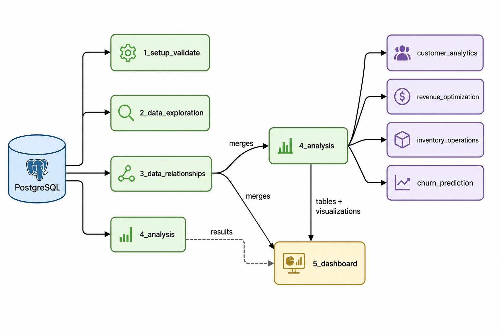

# DVD Rental Analytics

This is an analytics pipeline built on the DVD rental dataset. It connects to a PostgreSQL database, validates and explores the data, builds merged datasets for analysis, and produces insights across customer behaviour, revenue, and inventory. The results are then displayed through a multi-page Streamlit dashboard.

---

## Setup

### System Requirements

- Minimum: 4 GB RAM, 2 GB disk space (Recommended: 8 GB RAM, 5 GB disk space)
- Docker and Docker Compose
- Python 3.8+
- DVD rental backup file

### Database Setup

Start PostgreSQL and pgAdmin using Docker Compose:

```bash
docker compose up -d
```

Restore the DVD rental database using the provided script:

```bash
bash scripts/00_restore_dvdrental_docker.sh
```

The script copies the backup into the container, creates the `dvdrental` database, restores it, and runs a quick row count check to confirm the restore was successful.

Access pgAdmin at `http://localhost:5050` using the credentials in your `.env` file.

### Python Setup

```bash
python -m venv venv
source venv/bin/activate
pip install -r requirements.txt
```

Copy `.env.example` to `.env` and fill in your values:

```bash
cp .env.example .env
```

---

## Environment Variables

```dotenv
# PostgreSQL (Docker)
POSTGRES_USER=
POSTGRES_PASSWORD=
POSTGRES_DB=
POSTGRES_PORT=

# pgAdmin (Docker)
PGADMIN_DEFAULT_EMAIL=
PGADMIN_DEFAULT_PASSWORD=
PGADMIN_PORT=

# Application
DB_HOST=
DB_PORT=
DB_USER=
DB_PASSWORD=
DB_NAME=
```

---

## Running the Project

Run each script in order:

```bash
python 1_setup_validate.py      # connect, validate, and report on the database
python 2_data_exploration.py    # exploratory data analysis and visualizations
python 3_data_relationships.py  # build and validate merged datasets
python 4_analysis.py            # advanced analytics across specific themes
streamlit run 5_dashboard.py    # launch the dashboard
```

---

## Project Structure

```
dvd_rental_analytics/
├── assets/
│   └── architecture.png
├── advanced_analytics/
│   ├── customer_analytics.py
│   ├── revenue_optimization.py
│   ├── inventory_and_operations.py
│   └── churn_prediction.py
├── exports/
│   ├── merges/
│   ├── results/
│   ├── tables/
│   └── visualizations/
├── scripts/
│   └── 00_restore_dvdrental_docker.sh
├── 1_setup_validate.py
├── 2_data_exploration.py
├── 3_data_relationships.py
├── 4_analysis.py
├── 5_dashboard.py
├── helper.py
├── settings.py
├── docker-compose.yml
├── .env.example
├── README.md
├── Executive_Summary.md
├── Executive_Report.md
└── requirements.txt

```

---

## Architecture



---

## Data Description

The DVD rental dataset models a physical video rental store with 15 tables.

### Critical Tables

| Table | Description |
|---|---|
| `film` | Film catalogue. Includes title, rental rate, rental duration, replacement cost, and rating. |
| `customer` | Registered customers. Includes name, email, store assignment, and active status. |
| `rental` | One row per rental transaction. Links a customer to an inventory item with rental and return dates. |
| `payment` | One row per payment. Linked to a rental, records the amount and payment date. |
| `inventory` | Physical copies of films. Each copy is assigned to a store. |
| `store` | Store records. Each store has a managing staff member and an address. |

### Reference and Bridge Tables

| Table | Description |
|---|---|
| `actor` | Actor names. |
| `film_actor` | Bridge table linking films to actors. |
| `category` | Film categories such as Action, Comedy, and Horror. |
| `film_category` | Bridge table linking films to categories. |
| `language` | Languages. Referenced by film. |
| `staff` | Staff members. Each is assigned to a store. |
| `address` | Addresses for customers, staff, and stores. |
| `city` | Cities. Referenced by address. |
| `country` | Countries. Referenced by city. |

### Key Relationships

`rental` is the central transaction table. Every rental links a `customer` to an `inventory` item. `inventory` connects to `film` and `store`. `payment` is recorded separately and links back to `rental`, which means a rental row can exist without a corresponding payment row if the customer has not yet returned the film.

---

## Analysis Themes

| Theme | File | Key Outputs |
|---|---|---|
| Customer Segmentation | `customer_analytics.py` | `customer_segments.csv` |
| Lifetime Value | `customer_analytics.py` | `customer_ltv.csv` |
| Churn Risk | `customer_analytics.py` | `customer_churn_risk.csv` |
| Behavioral Patterns | `customer_analytics.py` | `customer_pending_returns.csv` |
| Category Performance | `revenue_optimization.py` | `category_performance.csv` |
| Temporal Trends | `revenue_optimization.py` | `temporal_trends.csv` |
| Pricing Insights | `revenue_optimization.py` | `pricing_insights.csv` |
| Film Turnover | `inventory_operations.py` | `film_turnover.csv` |
| Store Comparison | `inventory_operations.py` | `store_comparison.csv` |
| Stock Efficiency | `inventory_operations.py` | `overstocked_films.csv`, `understocked_films.csv` |
| Churn Prediction | `churn_prediction.py` | `churn_predictions.csv` |

